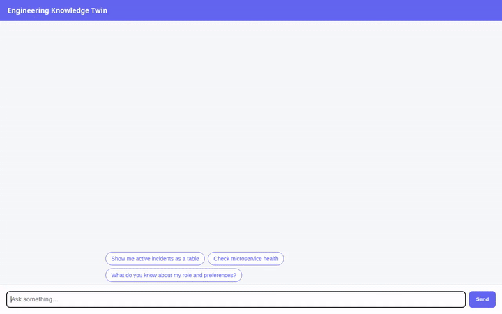

# Engineering Knowledge Twin 🤖🛠️

An AI-powered engineering companion built with the Google Agent Development Kit (ADK), Vertex AI Memory Bank, Cloud Firestore, Cloud Storage, and A2UI. The Engineering Knowledge Twin assists site reliability engineers (SREs) and software developers in tracking incidents, checking microservice health, querying public GitHub repositories, generating architecture diagrams, executing Python code in a secure sandbox, and maintaining long-term memory across sessions.



---

## 🌟 Key Capabilities

### 1. 🧠 Long-Term Memory (Vertex AI Memory Bank)
* **Preloaded Fact Retrieval**: Uses `PreloadMemoryTool` and `load_memory` to search long-term memory for user roles, technical preferences, and historical facts.
* **Automatic Fact Extraction**: Employs an `after_agent_callback` (`generate_memories_callback`) that automatically extracts facts and saves session context to Vertex AI Memory Bank across turns.

### 2. 📋 Incident Management (Google Cloud Firestore)
* **`list_incidents`**: Query active engineering incidents filtered by service name or status (`OPEN`, `INVESTIGATING`, `RESOLVED`, `CLOSED`).
* **`get_incident_details`**: Fetch complete incident records by ID from Cloud Firestore.
* **`create_incident`**: Log new system incidents with title, severity level, affected service, description, and assigned engineer.
* **`update_incident_status`**: Update the status of existing Firestore incident documents.

### 3. 🎨 System Architecture Diagrams (Gemini & Cloud Storage)
* **`generate_architecture_diagram`**: Generates visual system architecture and component diagrams using `gemini-3.1-flash-lite-image`.
* **Public Asset Hosting**: Uploads generated diagram images directly to a Google Cloud Storage bucket (`engineering-knowledge-twin-assets-8bad3776`) and returns secure public HTTPS URLs.

### 4. 🎛️ Agent-to-User Interface (A2UI v0.8)
* **Structured UI Components**: Uses an `after_model_callback` (`a2ui_callback`) built with `A2uiSchemaManager` (v0.8) and `BasicCatalog`.
* **Rich Card Rendering**: Renders responses as structured Cards, Columns, Rows, Text elements, Image views, and interactive Action/Prompt Chips.

### 5. 💻 Secure Code Execution
* **`AgentEngineSandboxCodeExecutor`**: Safely executes Python code blocks within Google Agent Engine's isolated sandbox environment.

### 6. 🌐 External Diagnostic & GitHub Tools
* **`check_service_health`**: Inspect real-time status codes, HTTP latency, and endpoints for internal microservices (`auth-service`, `billing-service`, `analytics-frontend`).
* **`get_github_repo_info`**: Query GitHub's REST API for public repository statistics (stars, forks, open issues, license, primary language).

---

## 🏗️ Architecture Overview

```
               +----------------------------------+
               |     Web Browser (Chat UI)        |
               +----------------------------------+
                                |
                                v
               +----------------------------------+
               |      FastAPI Proxy (main.py)     |
               +----------------------------------+
                                |  (A2A Protocol)
                                v
               +----------------------------------+
               |     ADK Root Agent (Gemini 2.5)  |
               +----------------------------------+
                 /        |        |        \
                v         v        v         v
         [Firestore]   [Memory]  [GCS]   [Sandbox]
          Incidents     Bank     Images   Python Code
```

---

## 🛠️ Setup & Local Running Instructions

### Prerequisites
* Python 3.10+
* Google Cloud CLI (`gcloud`) authenticated with access to a GCP project.

### 1. Install Dependencies
```bash
# Install root agent dependencies
pip install -r requirements.txt

# Install frontend proxy dependencies
pip install -r frontend/requirements.txt
```

### 2. Configure Environment Variables
Set the Google Cloud project and required service identifiers:
```bash
export FIRESTORE_PROJECT_ID="your-gcp-project-id"
export GCS_BUCKET_NAME="your-gcs-bucket-name"
export AGENT_ENGINE_RESOURCE_NAME="projects/PROJECT/locations/LOCATION/reasoningEngines/ENGINE_ID"
export AGENT_DIRECTORY="app"
```

### 3. Run the Agent Locally with ADK Dev UI
To launch the agent using the Agent Development Kit interactive web inspector:
```bash
adk web app
```
Navigate to `http://localhost:8000/dev-ui/?app=app` in your web browser.

### 4. Run the Custom FastAPI Frontend Proxy
To run the lightweight chat interface locally:
```bash
cd frontend
python main.py
```
Navigate to `http://localhost:8080` in your web browser.

---

## 🚀 Deployment Instructions

### Deploy Agent to Agent Runtime
```bash
agents-cli deploy agent_runtime --project your-gcp-project-id --region us-east1
```

### Deploy Frontend Proxy to Cloud Run
```bash
gcloud run deploy engineering-knowledge-twin-frontend \
  --source ./frontend \
  --region us-east1 \
  --allow-unauthenticated \
  --memory 256Mi \
  --set-env-vars AGENT_ENGINE_RESOURCE_NAME="YOUR_REASONING_ENGINE_RESOURCE_NAME",AGENT_DIRECTORY="app" \
  --project your-gcp-project-id
```

---

## 📄 License
Licensed under the Apache License, Version 2.0.
